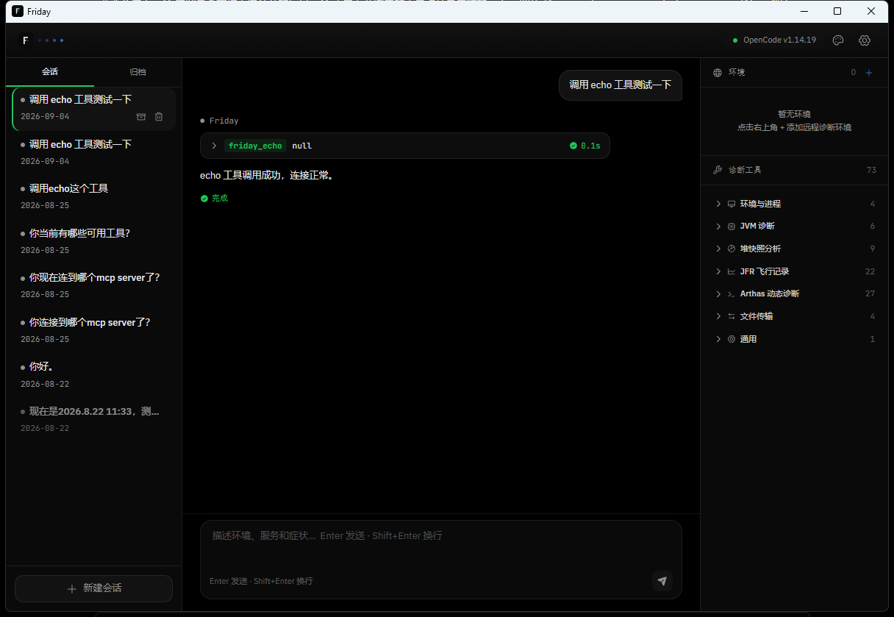
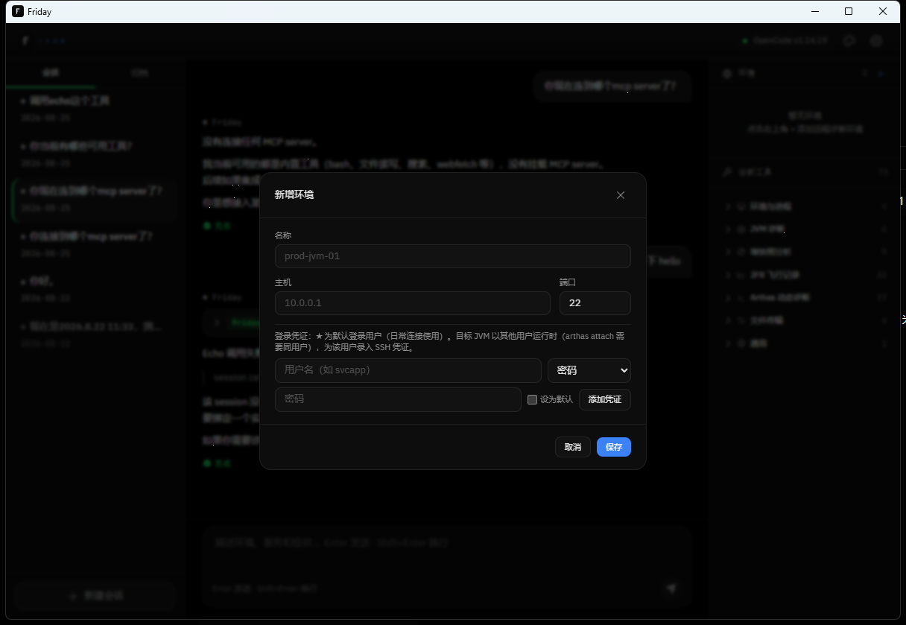
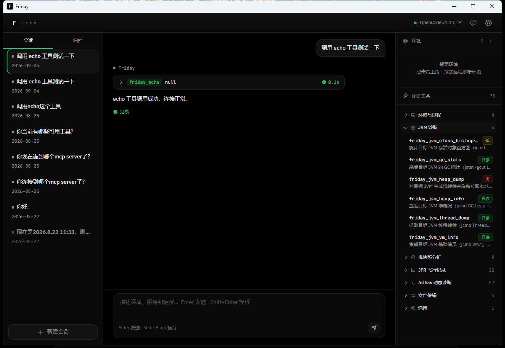

<div align="center">


# Friday

**面向软件开发人员的远程环境运行时故障诊断 Agent**

[](https://github.com/Ewan-90n9/Friday/releases)
[](https://github.com/Ewan-90n9/Friday/releases/latest)

</div>

---

## Friday 是什么

Friday 是一个跑在你本地电脑上的桌面应用（当前支持 Windows）。你只需要告诉它"哪个环境、哪个服务、什么症状"，比如：

> xx.xx.xx.xx 环境 OOMService OOM 了，帮我定位

它会自动通过 SSH 连接目标环境，像一位熟练的值班工程师那样逐步执行诊断：列出 JVM 进程、采集 GC 统计、抓线程转储、生成堆快照并用 MAT 分析泄漏疑点、录制 JFR 飞行记录、attach Arthas 动态观测方法耗时……过程中每一步工具调用都在界面上实时可见、风险操作先经你确认，最终给出根因分析与结论。

一次典型的 OOM 诊断长这样：

1. Friday 通过 `friday_list_environments` / `friday_list_processes` 找到目标机器上的 JVM 进程
2. `friday_jvm_heap_info` / `friday_jvm_class_histogram` 初步判断内存构成
3. `friday_jvm_heap_dump` 生成堆快照（高风险操作，会先请求你确认），完成后自动拉回本地并用 MAT 建好索引
4. Agent 调用 `friday_heap_leak_suspects` / `friday_heap_dominator_tree` / `friday_heap_path_to_gc_roots` 定位泄漏对象及其引用链
5. 结合业务代码给出结论与修复建议，全程可追问、可补充信息

你不需要提前在目标机上安装任何诊断工具：MAT / JMC 分析引擎托管在 Friday 本地，JDK 工具链按需自动部署到目标环境临时目录，Arthas 包随应用分发、使用时自动上传。Friday 复用你本机已安装的 Agent CLI（opencode 或 codeagentcli）作为诊断大脑，无需额外配置 API Key。



## 核心能力

### 环境连接与命令执行

SSH 单通道直连目标环境（K8s 场景同样经 SSH 执行 kubectl，无需额外开放端口）；连接按环境池化复用，空闲 10 分钟自动断开。密码类凭证存 OS 密钥链，私钥直接引用 `~/.ssh/` 路径；同一环境可配置多套用户凭证。

| 工具 | 用途 | 确认级别 |
|------|------|----------|
| `friday_list_environments` | 列出已配置的环境供 Agent 选择 | 只读，自主执行 |
| `friday_ensure_tool` | 按需部署 JDK 诊断工具链到目标机（`/tmp/friday-tools`） | 低风险，确认后执行 |
| `friday_run_command` | 任意 shell 命令兜底，覆盖未结构化的检查 | 高风险，强制确认 |

### JVM 基础诊断

封装 jps / jstat / jcmd，自动检测目标机 JDK 路径与版本，输出结构化结果。

| 工具 | 用途 | 确认级别 |
|------|------|----------|
| `friday_list_processes` | 列出目标环境的 Java 进程（PID / 主类 / 参数） | 只读 |
| `friday_jvm_gc_stats` | GC 统计（分代使用率 / GC 次数与耗时） | 只读 |
| `friday_jvm_heap_info` | 堆内存分布（分代容量与占用） | 只读 |
| `friday_jvm_vm_info` | JVM 版本、启动参数、系统信息 | 只读 |
| `friday_jvm_thread_dump` | 线程转储（锁与阻塞分析） | 只读 |
| `friday_jvm_class_histogram` | 类直方图，快速定位大对象 | 低风险 |
| `friday_jvm_heap_dump` | 生成堆快照并自动拉回本地 | 高风险，强制确认 |

### 堆快照分析（MAT 引擎）

内置 Eclipse MAT（Memory Analyzer）分析引擎：堆快照拉回完成后自动建索引，Agent 直接调用分析工具定位泄漏；分析会话 LRU 管理、空闲 15 分钟自动回收。

| 工具 | 用途 | 确认级别 |
|------|------|----------|
| `friday_heap_open` | 打开（预热）指定堆快照 | 只读 |
| `friday_heap_leak_suspects` | 泄漏疑点报告 | 只读 |
| `friday_heap_dominator_tree` | 支配树（retained 排序，可逐层下钻） | 只读 |
| `friday_heap_histogram` | 类直方图（retained / shallow / 实例数排序） | 只读 |
| `friday_heap_object_info` | 对象详情（类、字段、大小） | 只读 |
| `friday_heap_path_to_gc_roots` | 对象到 GC root 的完整引用链 | 只读 |
| `friday_heap_references` | 出向 / 入向引用列表 | 只读 |
| `friday_heap_threads` | 线程栈与本地变量分析 | 只读 |
| `friday_heap_close` | 关闭分析会话，释放内存 | 只读 |

### JFR 飞行记录（JMC 引擎）

内置 JMC 分析引擎。`friday_jfr_record` 通过 jcmd 在目标 JVM 上定时录制（无需重启进程），结束自动拉回本地并预热，随后 Agent 用 21 个分析工具做多维诊断：

| 工具（节选） | 用途 | 确认级别 |
|------|------|----------|
| `friday_jfr_record` | 远程定时录制 JFR，自动拉回 | 低风险 |
| `friday_jfr_quick_analysis` | 一键智能诊断 | 只读 |
| `friday_jfr_rules` | JMC 规则引擎全量扫描 | 只读 |
| `friday_jfr_gc_detail` | GC 详情 | 只读 |
| `friday_jfr_hot_methods` | CPU 热点方法 | 只读 |
| `friday_jfr_thread_contention` | 锁竞争分析 | 只读 |
| `friday_jfr_deadlock_detection` | 死锁检测 | 只读 |
| `friday_jfr_memory_leaks` / `friday_jfr_predictive_leak` | 内存泄漏 / 预测性泄漏 | 只读 |
| `friday_jfr_compare` | 两份录制 A-B 对比 | 只读 |

其余 12 个分析工具：录制概览、CPU 火焰图、线程 CPU、异常/错误分析、IO 热点、safepoint、虚拟线程、分配热点、调用栈检索、指标相关性、请求瀑布图等，可在应用内工具面板查阅全量列表。

### Arthas 动态诊断

对接 Arthas 4.x 官方内置 MCP Server：Friday 经 SSH exec 通道 HTTP 桥代理通信，**无需目标机开放 TCP 转发**（`AllowTcpForwarding no` 的加固环境同样可用）。Arthas 包随应用分发，attach 时 SFTP 自动上传到目标机；同一 JVM 并发去重，空闲 15 分钟自动退出。

| 工具（节选） | 用途 | 确认级别 |
|------|------|----------|
| `friday_arthas_open` | attach 到目标 JVM | 低风险 |
| `friday_arthas_dashboard` | 实时面板（线程 / 内存 / GC） | 只读 |
| `friday_arthas_thread` | 线程分析（CPU / 死锁 / 阻塞） | 只读 |
| `friday_arthas_sc` / `friday_arthas_sm` | 查找类 / 方法 | 只读 |
| `friday_arthas_jad` | 反编译指定类 | 只读 |
| `friday_arthas_watch` | 观察方法出入参与异常 | 低风险 |
| `friday_arthas_trace` / `friday_arthas_stack` | 调用链耗时 / 调用栈 | 低风险 |
| `friday_arthas_ognl` / `friday_arthas_vmtool` | 表达式取值 / 强制 GC 等 | 低风险 |
| `friday_arthas_profiler` | async-profiler 火焰图 | 低风险 |
| `friday_arthas_close` | 停止并卸载 Arthas | 只读 |

共 27 个工具，另含 monitor / tt / mbean / classloader / vmoption / getstatic / dump 等。

### 文件传输

专用 SSH 连接后台异步传输，不阻塞诊断对话；断点续传、失败自动重试（5 次 / 2 小时预算）、聊天流内实时进度卡片。堆快照与 JFR 录制产物完成后自动拉回本地。

| 工具 | 用途 | 确认级别 |
|------|------|----------|
| `friday_file_download` | 目标机 → 本地 | 低风险 |
| `friday_file_upload` | 本地 → 目标机 | 高风险，强制确认 |
| `friday_transfer_status` | 查询传输进度 | 只读 |
| `friday_transfer_cancel` | 取消传输 | 只读 |

## 安装

**系统要求**：Windows 10 / 11（当前仅支持 Windows）

| 依赖 | 何时需要 | 说明 |
|------|----------|------|
| Agent CLI（opencode 或 codeagentcli） | 必须 | Friday 的诊断大脑。可执行文件放入 PATH 即可，Friday 启动时自动检测并探测版本 |
| Java 21+ | 使用堆快照 / JFR 分析时 | MAT / JMC 分析引擎以本地工人进程运行，依赖本机 Java |
| Artifactory 仓库地址 | 首次在目标机执行 JVM 诊断时 | 用于自动下载 JDK 工具链到目标环境临时目录 |

三步开始：

1. 从 [Releases](https://github.com/Ewan-90n9/Friday/releases) 下载最新版 `.msi` 或 `.exe` 并安装
2. 启动 Friday，在设置中确认 Agent CLI 已被自动识别（或手动指定路径）
3. 按下节添加第一个目标环境，发起第一次诊断

## 使用手册

### 首次启动准备

① **Agent CLI**：安装 opencode 或 codeagentcli，可执行文件加入 PATH。Friday 启动时自动检测，结果在设置弹窗中可见；检测不到时手动添加绝对路径。支持双 Agent 共存、随时切换。
② **Java 21+**：仅堆快照与 JFR 分析需要（JVM 基础诊断、Arthas 不依赖本机 Java）。
③ **Artifactory 地址**：在设置中填写公司制品库地址，首次执行 JVM 诊断时自动下载 JDK 工具链到目标机 `/tmp/friday-tools`，同环境后续复用。
④ **添加环境**：环境面板中新建（名称 / 主机 / 端口 / 凭证）。凭证支持密码（存 OS 密钥链）与私钥（引用 `~/.ssh/` 路径）两种。



### 发起一次诊断

界面为三栏布局：左侧会话列表、中间对话流、右侧诊断工具面板。

1. 点击左侧 **新建会话**
2. 在输入框描述问题：**环境 + 服务 + 症状**，越具体越好（附上 PID、报错信息更佳）
3. 观察诊断过程：Agent 思考文本与工具调用卡片实时流式渲染；出现确认卡片时选择允许或拒绝
4. 结论不满意可继续追问（多轮上下文保留）；诊断跑偏可随时点输入框旁的停止按钮终止

### 环境与凭证管理

- **环境列表**：编辑、删除、连接测试
- **多用户凭证**：同一环境可存多套账号（如 root 与应用账号），星标为默认；每条凭证可单独测试连接
- **用户对齐**：SSH 用户与 JVM 属主不一致时，Friday 自动用对应 JVM 用户的凭证建立临时连接执行 attach / jcmd 类操作

### 工具确认与安全边界

| 风险级别 | 行为 | 示例 |
|----------|------|------|
| 只读 | 自主执行，不打扰 | GC 统计、堆分析、Arthas dashboard |
| 低风险 | 弹窗确认后执行 | JFR 录制、Arthas attach、watch |
| 高风险 | 醒目警告 + 强制确认 | run_command、生成堆快照、上传文件到目标机 |

可在 Agent 设置弹窗中开启**免确认模式**：开启后所有工具调用（含高风险）不再弹确认，顶栏会显示开启状态。仅建议在个人测试 / 非生产环境使用。

### 诊断工具面板

右侧面板将 73 个诊断工具按 7 组折叠展示：环境（3）、JVM（7）、堆快照（9）、JFR（22）、Arthas（27）、文件传输（4）、内置（1）。默认全部收起，展开可查看每个工具的名称与用途描述，与对话流中工具卡片一致，便于人工查阅工具语义。



### 文件传输与产物拉回

- **自动拉回**：堆快照生成后自动后台拉回 `.hprof` 并预热 MAT；JFR 录制结束后自动拉回 `.jfr` 并预热 JMC。进度卡片实时显示在对话流中
- **手动传输**：直接让 Agent"把 xx 日志拉回来"或上传脚本到目标机
- **传输保障**：断点续传、失败自动重试（5 次 / 2 小时预算）、进度卡片上一键取消

### 外观与主题

顶栏主题菜单支持暗色（默认）/ 浅色 / 暖白三套主题，切换即时生效并本地持久化。

### 更新与卸载

新版本从 [Releases](https://github.com/Ewan-90n9/Friday/releases) 下载覆盖安装即可，会话与配置保留。卸载走系统"应用"设置。

## 路线图

### 已落地

- SSH 连接与命令执行、环境多用户凭证管理
- JVM 基础诊断（jstat / jcmd 系列）
- 堆快照分析（MAT 引擎，自动拉回 + 自动预热）
- JFR 飞行记录（JMC 引擎，远程录制 + 21 个分析工具）
- Arthas 动态诊断（27 个工具，SSH 桥接）
- 文件上传下载（断点续传 + 自动拉回）
- opencode / codeagentcli 双 Agent 接入
- 暗色 / 浅色 / 暖白多主题

### 下一批

- **Playbook 知识层**：结构化故障知识（症状 → 工具序列 → 判读要点），诊断时语义检索自动注入，首批覆盖 Java 高频故障（OOM / CPU 飙高 / GC 频繁 / 死锁）
- **知识导入管线**：URL / 文档抓取 + LLM 提炼为 Playbook 草稿，人工审核后生效，团队知识可沉淀灌入
- **脚本工具热插拔**：脚本 + 清单自服务注册诊断工具，Agent 无需重启即可调用
- **读日志 / 读 dump 结构化工具**：补齐"看现场"的最后两块拼图

### 远期

- 更多 Agent CLI 接入（claude code / codex 等）
- 自建 LLM client，绕过 Agent CLI 直连模型 API
- 知识爬虫管线、K8s 诊断 Playbook、经验时间衰减

> 细粒度进度以 [TODO.md](TODO.md) 为准。

## 开发构建

前置：Node.js、pnpm、Rust（MSVC 工具链）。

```bash
pnpm install
pnpm tauri dev                                          # 开发运行
pnpm tauri build                                        # 打包安装产物
pnpm typecheck                                          # 前端类型检查
cargo check --manifest-path src-tauri/Cargo.toml        # Rust 检查
cargo test --manifest-path src-tauri/Cargo.toml         # Rust 测试
```

### 文档

| 主题 | 文档 |
|------|------|
| 架构总览（决策表 + 分层图） | [docs/architecture/overview.md](docs/architecture/overview.md) |
| 运行时模型（通信 / 并发 / 取消） | [docs/architecture/runtime.md](docs/architecture/runtime.md) |
| 错误处理与安全边界 | [docs/architecture/error-handling.md](docs/architecture/error-handling.md) |
| 基础设施（凭证 / 日志） | [docs/architecture/infrastructure.md](docs/architecture/infrastructure.md) |
| 日志规范 | [docs/architecture/logging-standard.md](docs/architecture/logging-standard.md) |
| 知识层（Playbook） | [docs/architecture/playbook.md](docs/architecture/playbook.md) |
| 设计语言 | [docs/design/design-language.md](docs/design/design-language.md) |
